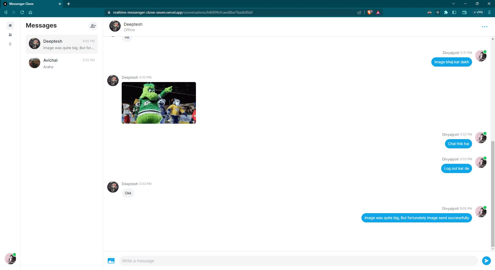

# Messenger Clone App (Next.js)

## ABOUT APP

A visually appealing Messenger clone app built using Next.js, Prism, MongoDB, Google Auth, Github Auth, Pusher, and Cloudinary. The app features a responsive design and real-time messaging capabilities.

Please Visit: [Messenger Clone](https://realtime-messenger-clone-seven.vercel.app/)

## TECHNOLOGY USED

- [Next.js](https://nextjs.org/docs): A React framework for building server-side rendered and static web applications.
- [Prisma](https://www.prisma.io/): Prisma is an open source next-generation ORM.
- [MongoDB](https://www.mongodb.com/docs/): A NoSQL database for storing and managing data.
- Google Cloud: Authentication mechanism using Google accounts.
- Github Auth: Authentication mechanism using GitHub accounts.
- [Pusher](https://pusher.com/docs/): A real-time messaging platform for enabling instant communication.
- [Cloudinary](https://cloudinary.com/developers): A cloud-based image and video management service.

## FEATURES

- Real-time messaging: Chat with friends in real-time, with instant message updates.
- Responsive design: The app is optimized for different screen sizes and devices.
- Send images to of every possible size
- Very fast because of Pusher API

## SCREENSHOT

## DEVELOPED BY

- Divyajyoti
